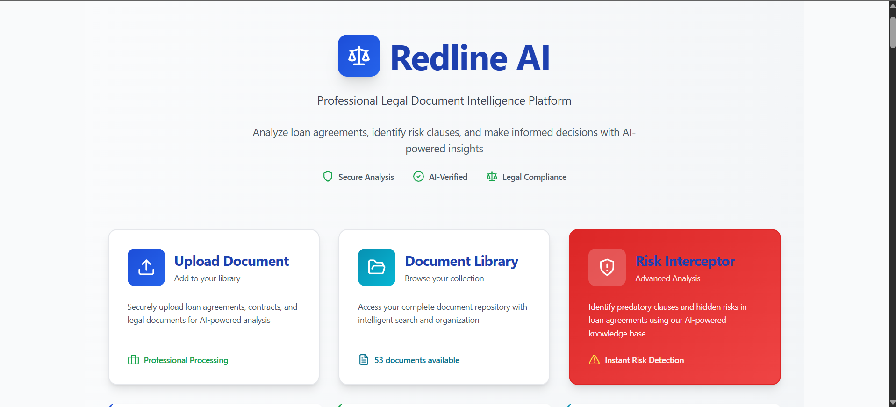
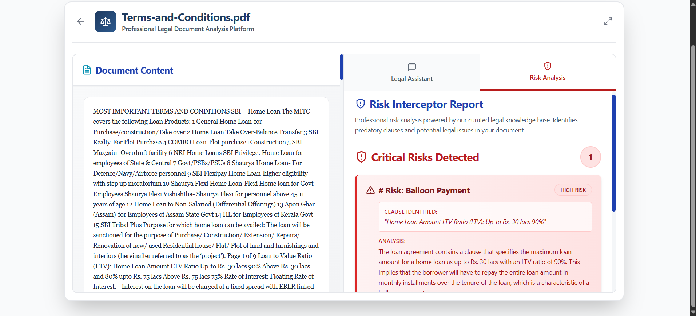

# Redline AI 🛡️

**A local-first, AI-powered platform for analyzing legal documents and proactively identifying predatory clauses.**

Redline AI is a full-stack web application designed for the high-stakes analysis of financial and legal documents. It provides two distinct modes of analysis:

1. **Comprehension Engine:** A flexible, RAG-based chat assistant that allows you to "talk" to your documents and ask specific questions.
2. **Interrogation Engine:** A proactive "Interceptor" that scans documents against a human-curated knowledge base to find and flag predatory or harmful clauses *before* they become a problem.

  
  

---

## 🌟 Core Features

* **Hybrid Analysis Platform:** Combines two distinct AI engines for comprehensive document understanding.
* **1. Comprehension Engine (RAG Chat):** Upload any PDF, DOCX, or TXT file and ask specific questions. The AI provides answers 100% grounded in the document's text, eliminating hallucinations.
* **2. Interrogation Engine (Risk Interceptor):** A one-click analysis that scans the document for known predatory terms (e.g., "Balloon Payment," "Prepayment Penalty") and provides a clear, actionable report of all risks found.
* **Local-First & Secure:** Built from the ground up for privacy. All AI processing (both embeddings and generation) runs **100% locally** using a local LLM (like Mistral). Your confidential documents are never sent to a third-party API.
* **Multi-Format Support:** Natively handles text extraction from `.pdf`, `.docx`, and `.txt` files.
* **Dynamic Knowledge Base:** The Interceptor's "brain" is a simple `risks.md` file. You can easily add, edit, or remove new risks without writing any code.

---

## 🏗️ Architecture

Redline AI is a full-stack application with a Django backend and a React frontend. Its "intelligence" is split into two unique processes.

### 1. The Comprehension Engine (RAG)

This is the "Chat Assistant" tab. It's a classic Retrieval-Augmented Generation (RAG) pipeline:

1. **Ingest:** A document is uploaded. `pdfplumber` or `python-docx` extracts the raw text.
2. **Chunk:** The text is split into small, semantic chunks.
3. **Embed:** Each chunk is converted into a vector embedding (using `all-MiniLM-L6-v2`) and stored in a FAISS in-memory vector index.
4. **Retrieve:** When a user asks a question, the question is embedded, and FAISS finds the most relevant text chunks from the document.
5. **Generate:** These chunks (as context) and the question are sent to the **local LLM** to generate a factually-grounded answer.

### 2. The Interrogation Engine (Hybrid Filter)

This is the "Risk Analysis" tab. It's a more robust and accurate **2-Step Hybrid Filter** designed to eliminate false positives:

1. **Load Knowledge:** The `risks.md` file is loaded into memory as a list of risk objects, each with a name, description, and keywords.
2. **Fast Python Pre-Filter (Step 1):** The system first performs a rapid, 1-millisecond keyword search. It scans the *entire* document text for *any* of the keywords associated with the risks (e.g., "prepayment charge," "balloon payment").
3. **LLM Verification (Step 2):** If, and *only if*, a keyword is found, the system then "spends" the expensive 15-second local LLM call. It sends the *full text* and a surgical prompt to the LLM.
4. **Surgical Prompt:** The prompt is highly specific:
   > "You are an expert. You must find the 'Prepayment Penalty' in this text. The keyword 'prepayment charge' was found. Is it being used in a predatory way? If yes, return the JSON with the clause. If no, return the JSON with 'found: false'."
5. **Aggregate Report:** The system does this in a loop for all risks and aggregates the final JSON responses into a clean report for the UI.

This hybrid approach is fast, accurate, and cost-effective. It doesn't waste LLM cycles on "clean" documents.

---

## 🛠️ Technology Stack

| Component | Technology |
|:---|:---|
| **Backend** | Django, Django REST Framework |
| **Frontend** | React.js, Axios, TailwindCSS |
| **LLM Engine** | **Local LLM** (Mistral 7B via LM Studio / Ollama) |
| **Embeddings** | `sentence-transformers` (`all-MiniLM-L6-v2`) |
| **Vector DB** | FAISS (in-memory) |
| **File Processing** | `pdfplumber`, `python-docx` |

---

## 🚀 Setup & Installation

This is a full-stack project that requires **three** separate services to be running.

### 1. Prerequisites

Before you begin, you **must** have the following installed:

* [Python 3.10+](https://www.python.org/)
* [Node.js 18+](https://nodejs.org/)
* [Git](https://git-scm.com/)
* **A Local LLM Server (LM Studio)**:
    1. [Download LM Studio](https://lmstudio.ai/)
    2. In the app, search for and download a model. **Mistral 7B Instruct** is highly recommended.
    3. Go to the "Local Server" tab (looks like `<->`)
    4. Select your Mistral model at the top
    5. Click **"Start Server"**
    6. This will make your local LLM available at `http://localhost:1234/v1/`, which the Django backend is configured to call

### 2. Backend Setup (Django)
```bash
# 1. Clone the repository
git clone https://your-repo-url/RedlineAI.git
cd RedlineAI/backend

# 2. Create a virtual environment and activate it
python -m venv venv

# On Windows:
.\venv\Scripts\activate

# On Mac/Linux:
source venv/bin/activate

# 3. Install Python dependencies
pip install -r requirements.txt

# 4. Create your 'risks.md' file
# (This is CRITICAL. Create this file in the 'backend' folder)
# You can copy the content from 'risks.md' in this repository.

# 5. Run the database migrations
python manage.py migrate

# 6. Start the Django server
# (Leave this terminal running)
python manage.py runserver
```

Your backend is now running on `http://localhost:8000`.

### 3. Frontend Setup (React)
```bash
# 1. Open a NEW terminal
cd RedlineAI/frontend

# 2. Install Node.js dependencies
npm install

# 3. Start the React development server
# (Leave this terminal running)
npm run start
```

Your frontend is now running on `http://localhost:3000` and will automatically open in your browser.

---

## ▶️ How to Run

To use the application, all three services must be running:

1. **Terminal 1 (LLM):** Your LM Studio server is running
2. **Terminal 2 (Backend):** Your Django server is running (`python manage.py runserver`)
3. **Terminal 3 (Frontend):** Your React server is running (`npm run start`)

You can now use the app by navigating to `http://localhost:3000` in your browser.

---

## 🧠 Customizing the "Brain"

You can easily add new risks to the Interceptor without any code.

1. Open the `backend/risks.md` file
2. Add a new entry following the exact format. The **Keywords to find** are the most important part. They are case-insensitive and checked by the Python pre-filter.
```markdown
# Risk: [Your New Risk Name]
- **Description:** [A brief description of the risk]
- **Why it's harmful:** [Why this is bad for the user]
- **Keywords to find:** "keyword1", "second keyword phrase", "another-kw"
```

3. Save the file. The changes will be picked up on the next analysis run.

---

## 📂 Project Structure
```
RedlineAI/
├── backend/
│   ├── api/                  # Django app containing all endpoints
│   ├── risks.md              # Knowledge base for risk detection
│   ├── manage.py
│   ├── requirements.txt
│   └── ...
├── frontend/
│   ├── src/
│   │   ├── components/       # React components
│   │   ├── App.js
│   │   └── ...
│   ├── package.json
│   └── ...
└── README.md
```

---

## 🔒 Privacy & Security

Redline AI is designed with privacy as the top priority:

* **No Cloud APIs:** All AI processing happens locally on your machine
* **No Data Upload:** Your documents never leave your computer
* **No Logging:** Document contents are not stored or logged
* **Open Source:** Full transparency in how your data is processed

---

## 🤝 Contributing

Contributions are welcome! Please feel free to submit a Pull Request. For major changes, please open an issue first to discuss what you would like to change.

---

## 📄 License

This project is licensed under the MIT License - see the LICENSE file for details.

---

## 🙏 Acknowledgments

* Built with [Django](https://www.djangoproject.com/) and [React](https://react.dev/)
* Powered by [LM Studio](https://lmstudio.ai/) for local LLM inference
* Vector embeddings via [Sentence Transformers](https://www.sbert.net/)
* Vector search with [FAISS](https://faiss.ai/)

---

## 📞 Support

If you encounter any issues or have questions, please [open an issue](https://github.com/AdityaCJaiswal/home-loan-documents-analyzer/issues) on GitHub.

---

**Built with ❤️ for document safety and transparency**