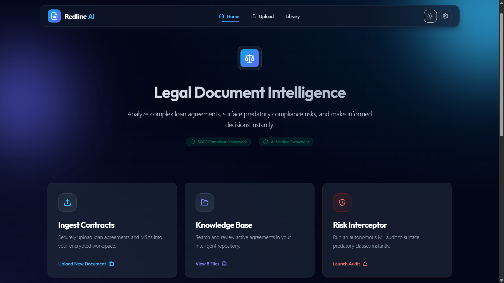
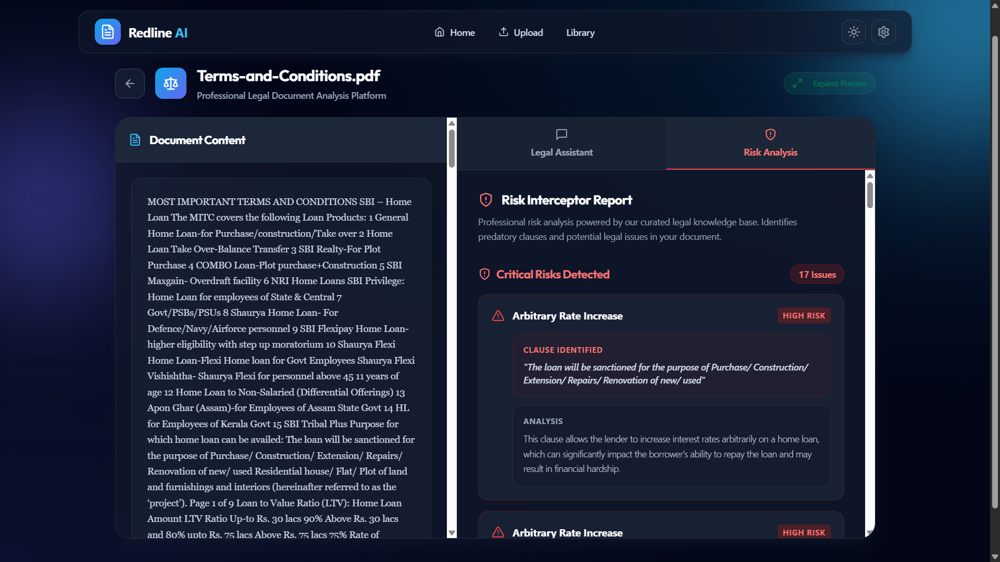

# Redline AI 🛡️

**A local-first, AI-powered platform for analyzing legal documents and proactively identifying predatory clauses.**

Redline AI is a full-stack web application designed for the high-stakes analysis of financial and legal documents. It provides two distinct modes of analysis:

1. **Comprehension Engine:** A flexible, RAG-based chat assistant that allows you to "talk" to your documents and ask specific questions.
2. **Interrogation Engine:** A highly robust Machine Learning classifier powered by Logistic Regression and LegalBERT, trained to proactively evaluate clauses and intercept risks before they become a problem.

  
  

---

## 🌟 Core Features

* **Hybrid Analysis Platform:** Combines an LLM comprehension chat and a dedicated ML Interceptor.
* **1. Comprehension Engine (RAG Chat):** Upload any PDF, DOCX, or TXT file and ask specific questions. The AI provides answers 100% grounded in the document's text, eliminating hallucinations.
* **2. Interrogation Engine (Risk Interceptor):** Powered by an autonomous SCiKit-Learn model (`LogisticRegression`) trained on the CUAD legal dataset. Provides a one-click analysis that deeply maps and flags risky structures into four severity levels (Safe, Low, Medium, High) within seconds.
* **Local-First & Secure:** Built from the ground up for privacy. All AI processing (both embeddings and generation) runs **100% locally** using a local LLM (like Mistral). Your confidential documents are never sent to a third-party API.
* **Domain Context:** We leverage `nlpaueb/legal-bert-base-uncased` to fully comprehend complex 'legalese' nuances.
* **Modern Enterprise UI:** Complete end-to-end interface overhauled with a stunning 'Glassmorphic' TailwindCSS design.

---

## 🏗️ Architecture

Redline AI is a full-stack application with a Django backend and a React frontend. Its "intelligence" is split into two unique processes.

### 1. The Comprehension Engine (RAG)

This is the "Chat Assistant" tab. It's a classic Retrieval-Augmented Generation (RAG) pipeline:

1. **Ingest:** A document is uploaded. `pdfplumber` or `python-docx` extracts the raw text.
2. **Chunk:** The text is split into small, semantic chunks.
3. **Embed:** Each chunk is converted into a vector embedding (using `nlpaueb/legal-bert-base-uncased` LegalBERT) and stored in a FAISS in-memory vector index.
4. **Retrieve:** When a user asks a question, the question is embedded, and FAISS finds the most relevant text chunks from the document.
5. **Generate:** These chunks (as context) and the question are sent to the **local LLM** to generate a factually-grounded answer.

### 2. The Interrogation Engine (ML Classifier)

This is the "Risk Analysis" tab. Built purely for strict clause-checking, this leverages a robust **Logistic Regression** model for its heavy lifting:

1. **ML Classification Preparation:** A model (`risk_classifier.pkl`) is generated locally by training a `LogisticRegression` algorithm on a massive real-world dataset grouping safe vs. predatory clauses (such as the CUAD database).
2. **Chunking & Legal Vectorization:** The uploaded document is dynamically split into individual, clause-level chunks. They are embedded via the 768-dimensional `LegalBERT`.
3. **Autonomous Risk Flagging:** The ML model rapidly maps and assesses the chunks, classifying each clause into a highly deterministic severity level (Safe, Low, Medium, High).
4. **Targeted Formatting:** Any chunk deemed actively predatory is handed cleanly to the local LLM to surgically parse the risk name and exactly *why* it's bad, returning structured JSON directly back to the front-end.

This multi-tiered structure completely mitigates the problem of LLM hallucinations while avoiding burning unnecessary cycles on inherently "clean" documents.

---

## 🛠️ Technology Stack

| Component | Technology |
|:---|:---|
| **Backend** | Django, Django REST Framework |
| **Frontend** | React.js, Axios, TailwindCSS (Glassmorphism & Interactive UI) |
| **LLM Engine** | **Local LLM** (Mistral 7B via LM Studio / Ollama) |
| **Embeddings** | `sentence-transformers` (`nlpaueb/legal-bert-base-uncased`) |
| **Classification Logic** | `scikit-learn` (`LogisticRegression`) |
| **Vector DB** | FAISS (in-memory) |
| **File Processing** | `pdfplumber`, `python-docx` |

---

## 🚀 Setup & Installation

This is a full-stack project that requires **three** separate services to be running.

### 1. Prerequisites

Before you begin, you **must** have the following installed:

* [Python 3.10+](https://www.python.org/)
* [Node.js 18+](https://nodejs.org/)
* [Git](https://git-scm.com/)
* **A Local LLM Server (LM Studio)**:
    1. [Download LM Studio](https://lmstudio.ai/)
    2. In the app, search for and download a model. **Mistral 7B Instruct** is highly recommended.
    3. Go to the "Local Server" tab (looks like `<->`)
    4. Select your Mistral model at the top
    5. Click **"Start Server"**
    6. This will make your local LLM available at `http://localhost:1234/v1/`, which the Django backend is configured to call

### 2. Backend Setup (Django)
```bash
# 1. Clone the repository
git clone https://your-repo-url/RedlineAI.git
cd RedlineAI/backend

# 2. Create a virtual environment and activate it
python -m venv venv

# On Windows:
.\venv\Scripts\activate

# On Mac/Linux:
source venv/bin/activate

# 3. Install Python dependencies
pip install -r requirements.txt

# 4. Supply Required Dataset (Optional for immediate usage but highly recommended)
# Place the `labeled_clauses.csv` dataset into the `backend/` directory for full training.

# 5. Run the database migrations
python manage.py migrate

# 6. Train the Multiclass Logistic Regression model (CRITICAL! Do this once to create risk_classifier2.pkl)
python train_logistic.py

# 7. Start the Django server
# (Leave this terminal running)
python manage.py runserver
```

Your backend is now running on `http://localhost:8000`.

### 3. Frontend Setup (React)
```bash
# 1. Open a NEW terminal
cd RedlineAI/frontend

# 2. Install Node.js dependencies
npm install

# 3. Start the React development server
# (Leave this terminal running)
npm run start
```

Your frontend is now running on `http://localhost:3000` and will automatically open in your browser.

---

## ▶️ How to Run

To use the application, all three services must be running:

1. **Terminal 1 (LLM):** Your LM Studio server is running
2. **Terminal 2 (Backend):** Your Django server is running (`python manage.py runserver`)
3. **Terminal 3 (Frontend):** Your React server is running (`npm run start`)

You can now use the app by navigating to `http://localhost:3000` in your browser.

---

## 🧠 Advanced: Upgrading the ML Model

The core logic powering the Interceptor can be expanded by enhancing the Logistic Regression pipeline. 

1. Gather new diverse legal clause data sets and merge them securely into `labeled_clauses.csv`.
2. Map your relevant categorization lists grouping severities (Safe, Low, Medium, High) in `train_logistic.py`.
3. Stop the backend server and re-run:
```bash
python train_logistic.py
```
4. This reconstructs `risk_classifier2.pkl`, vastly broadening what the model recognizes in embedded text going forward.

---

## 📂 Project Structure
```
RedlineAI/
├── backend/
│   ├── api/                  # Django app containing all endpoints
│   ├── train_classifier.py   # Code for compiling the logistic regression pipeline
│   ├── risk_classifier.pkl   # Built locally: output model file
│   ├── manage.py
│   ├── requirements.txt
│   └── ...
├── frontend/
│   ├── src/
│   │   ├── components/       # React components
│   │   ├── App.js
│   │   └── ...
│   ├── package.json
│   └── ...
└── README.md
```

---

## 🔒 Privacy & Security

Redline AI is designed with privacy as the top priority:

* **No Cloud APIs:** All AI processing happens locally on your machine
* **No Data Upload:** Your documents never leave your computer
* **No Logging:** Document contents are not stored or logged
* **Open Source:** Full transparency in how your data is processed

---

## 🤝 Contributing

Contributions are welcome! Please feel free to submit a Pull Request. For major changes, please open an issue first to discuss what you would like to change.

---

## 📄 License

This project is licensed under the MIT License - see the LICENSE file for details.

---

## 🙏 Acknowledgments

* Built with [Django](https://www.djangoproject.com/) and [React](https://react.dev/)
* Powered by [LM Studio](https://lmstudio.ai/) for local LLM inference
* Vector embeddings via [Sentence Transformers](https://www.sbert.net/)
* Vector search with [FAISS](https://faiss.ai/)

---

## 📞 Support

If you encounter any issues or have questions, please [open an issue](https://github.com/AdityaCJaiswal/home-loan-documents-analyzer/issues) on GitHub.

---

**Built with ❤️ for document safety and transparency**